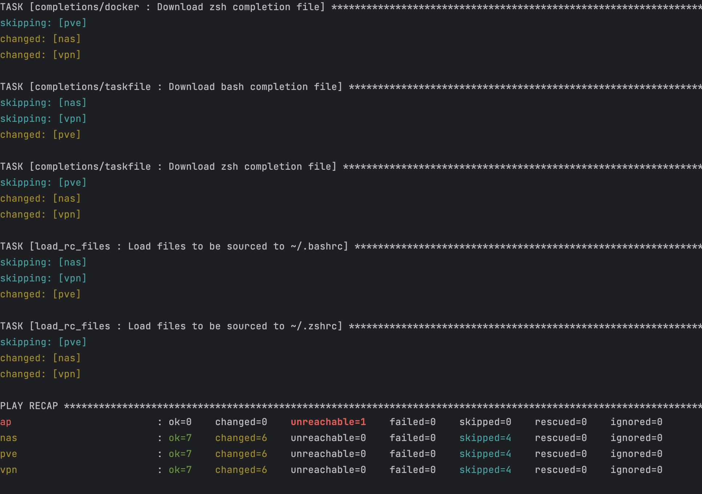

<p align="center">

</p>

# Appliance Dotfiles

A series of `ansible` playbooks to setup appliances with some customisation.

<!-- START doctoc generated TOC please keep comment here to allow auto update -->
<!-- END doctoc generated TOC please keep comment here to allow auto update -->

**Usage**:

<!-- task-start -->
<!-- DO NOT EDIT THIS SECTION - IT IS UPDATED BY A GITHUB WORKFLOW -->
<pre>
task: Available tasks for this project:
* actionlint:            Lint all workflow yaml files
* lint:                  Lint all yaml files (and actionlint on workflow files)
* action:run:            Run a workflow locally (e.g. `task action:run JOB_NAME=yaml-lint WORKFLOW_FILE=.github/workflows/yaml-lint.yaml`)
* ansible:apply:         Run the given playbook
* ansible:dry-run:       For the given playbook, do a dry-run
* ansible:install:       Install ansible galaxy collections and roles
* ansible:lint:          Lint all ansible files
* ansible:list:          List tasks that will be run for the playbook
</pre>
<!-- task-end -->

## Dotfiles

Add to `roles/copy_rc_files/files` for more customisation in appliances.

## Testing Ansible Connectivity

```bash
ansible --inventory-file=inventory.yaml --module-name=setup nas
```

```bash
ansible --inventory-file=inventory.yaml --module-name=gather_facts nas
```

## Playbooks

> [!NOTE]
> List tasks to be executed:

```bash
task ansible:list -- setup_rc_files.yaml
```

> [!NOTE]
> Dry-run a playbook:

```bash
task ansible:dry-run -- setup_rc_files.yaml
```

> [!NOTE]
> Run a playbook:

```bash
task ansible:apply -- setup_rc_files.yaml
```

<!-- playbook-steps-start -->
<!-- DO NOT EDIT THIS SECTION - IT IS UPDATED BY A GITHUB WORKFLOW -->
<pre>

playbook: setup_rc_files.yaml

  play #1 (all): Setup rc files	TAGS: []
    tasks:
      copy_rc_files : Ensure the appliance-dotfiles directory exists	TAGS: []
      copy_rc_files : Copy the files to be sourced to the appliance-dotfiles directory on remote	TAGS: []
      copy_rc_files : Copy bash only files to be sourced to the appliance-dotfiles directory on remote	TAGS: []
      copy_rc_files : Copy zsh only files to be sourced to the appliance-dotfiles directory on remote	TAGS: []
      completions/docker : Download bash completion file	TAGS: []
      completions/docker : Download zsh completion file	TAGS: []
      completions/taskfile : Download bash completion file	TAGS: []
      completions/taskfile : Download zsh completion file	TAGS: []
      load_rc_files : Load files to be sourced to ~/.bashrc	TAGS: []
      load_rc_files : Load files to be sourced to ~/.zshrc	TAGS: []

playbook: setup_tmux.yaml

  play #1 (all): Setup tmux(intator) files	TAGS: []
    tasks:
      tmux : Copy tmux config file	TAGS: []
</pre>
<!-- playbook-steps-end -->

<p align="center">

</p>
